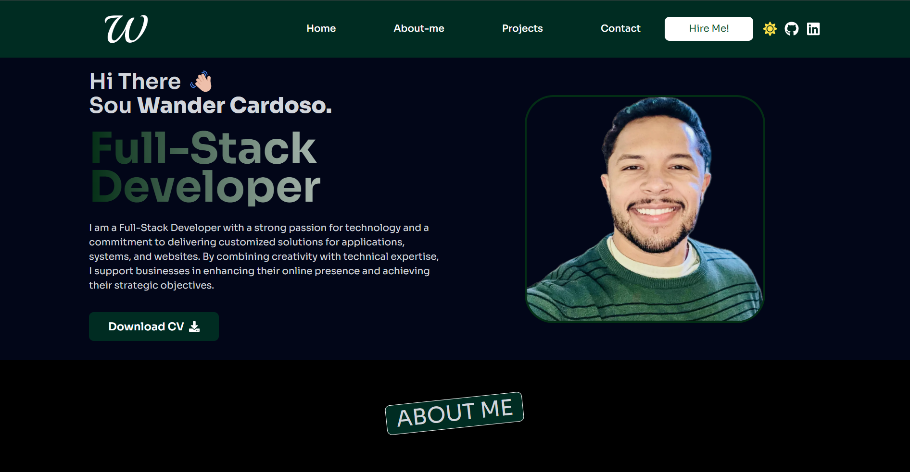

# 🚀 Meu Portfólio Profissional


---

## ✨ Apresentação

Olá! É com muita satisfação que compartilho com vocês meu portfólio.  
Desenvolvido do zero com foco em:

- 🛜 **Performance**
- ♿ **Acessibilidade**
- 🧱 **Responsividade**
- 🧠 **Código limpo e organizado**
- 🔐 **Segurança e boas práticas**
- 📩 **Formulários funcionais**
- 🎯 **Soluções personalizadas**

---

## 🛠️ Tecnologias Utilizadas

- [React](https://reactjs.org/)
- [Next.js](https://nextjs.org/)
- [TypeScript](https://www.typescriptlang.org/)
- [Tailwind CSS](https://tailwindcss.com/)
- [Node.js](https://nodejs.org/)
- [NPM](https://www.npmjs.com/)

---

## 🌐 Deploy

Meu portfólio está online graças à [**Vercel**](https://vercel.com).  
Clique aqui para acessar 👉 [dev-portifyle.vercel.app](https://dev-portifyle.vercel.app/)

---


```
